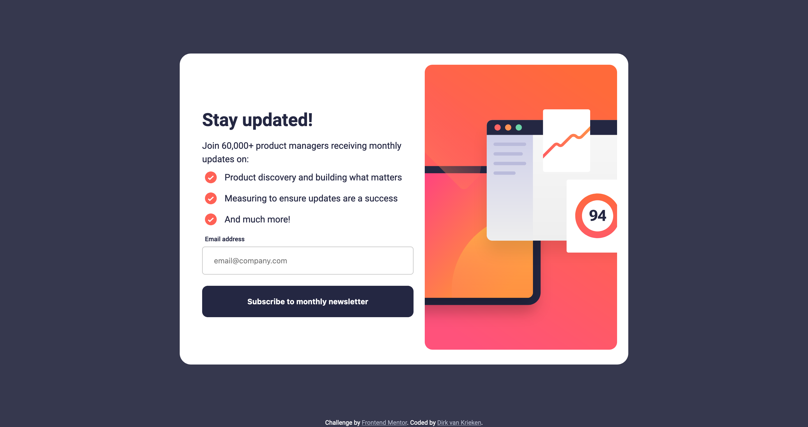

# Frontend Mentor - Newsletter sign-up form with success message solution

This is a solution to the [Newsletter sign-up form with success message challenge on Frontend Mentor](https://www.frontendmentor.io/challenges/newsletter-signup-form-with-success-message-3FC1AZbNrv). Frontend Mentor challenges help you improve your coding skills by building realistic projects.

## Table of contents

- [Overview](#overview)
  - [The challenge](#the-challenge)
  - [Screenshot](#screenshot)
  - [Links](#links)
- [My process](#my-process)
  - [Built with](#built-with)
  - [What I learned](#what-i-learned)
- [Author](#author)

## Overview

### The challenge

Users should be able to:

- Add their email and submit the form
- See a success message with their email after successfully submitting the form
- See form validation messages if:
  - The field is left empty
  - The email address is not formatted correctly
- View the optimal layout for the interface depending on their device's screen size
- See hover and focus states for all interactive elements on the page

### Screenshot



### Links

- Solution URL: [https://github.com/dirkvankrieken/newsletter-sign-up-with-success-message](https://github.com/dirkvankrieken/newsletter-sign-up-with-success-message)
- Live Site URL: [https://dirkvankrieken.github.io/newsletter-sign-up-with-success-message/](https://dirkvankrieken.github.io/newsletter-sign-up-with-success-message/)

## My process

### Built with

- Semantic HTML5 markup
- CSS custom properties
- Flexbox
- Mobile-first workflow
- Javascript

### What I learned

- How to validate an import form element to check if a correctly formatted email is provided using Javascript.
- Using <picture> and <source> elements to make the browser select an image depending on the size of the browser window.

```
<picture>
  <source media="(max-width: 799px)" srcset="assets/images/illustration-sign-up-mobile.svg" />
  <source media="(min-width: 800px)" srcset="assets/images/illustration-sign-up-desktop.svg" />
  
</picture>
```

## Author

- Website - [dirkvankrieken.com](https://dirkvankrieken.com)
- Frontend Mentor - [@dirkvankrieken](https://www.frontendmentor.io/profile/dirkvankrieken)
